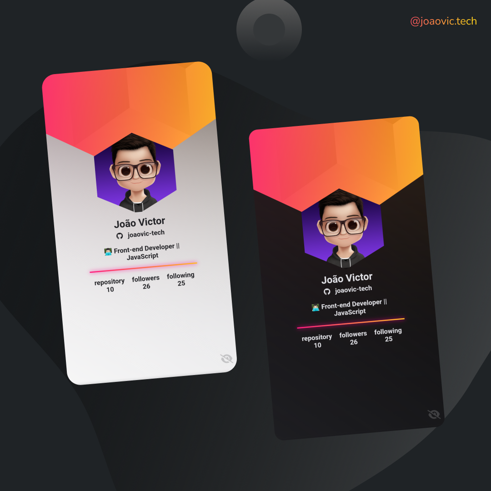
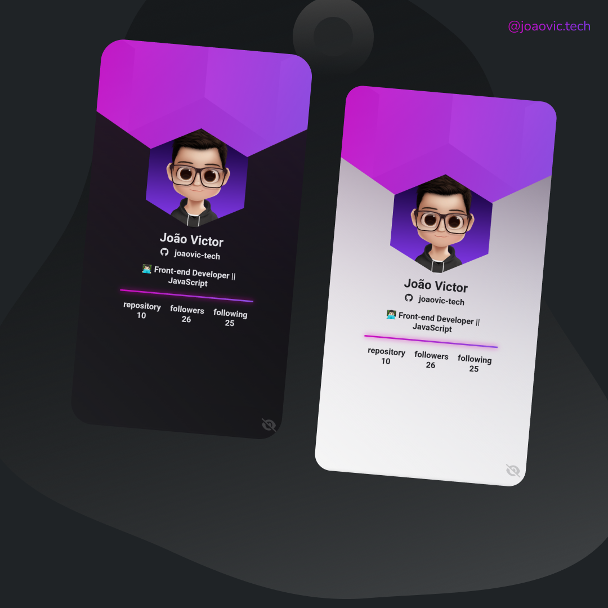
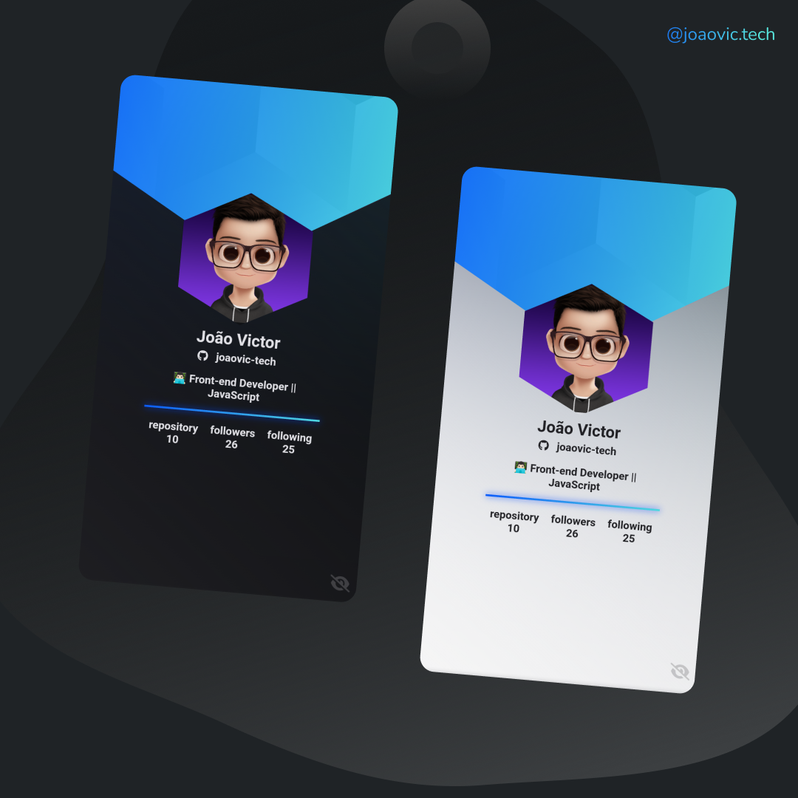
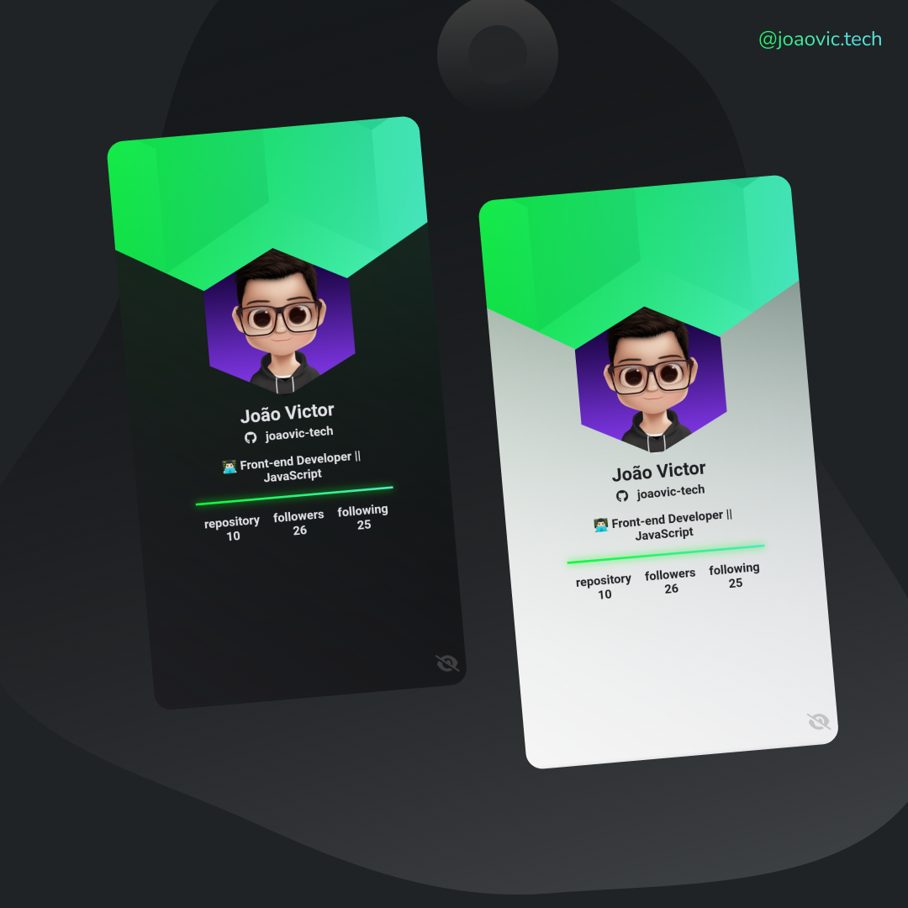

# badge-nlw
Virtual badge created in ORIGIN trail at NLW Heat
<hr>

<h4 align="center">Badges📛</h4>

| Badge 1                                     | Badge 2                                            |
|:-------------------------------------------------:|:-----------------------------------------------:|
|   |          |
| Badge 3                                   | Badge 4                                 |
|  |  |

## Reference

 - [Virtual Badge](https://badge-github.vercel.app/)
 - [My Portfolio](https://joaovictor-portfolio.vercel.app/)
 - [Application Layout](https://www.figma.com/community/file/1031698737363668691/%5BNLW-Heat---Mission%3A-Origin%5D-DoWhile2021)
 - [Colors](#colors)
 - [Tampletes](#tampletes)

## Functionalities

- Search all github users
- Adapted for web and mobile devices
- Dark and light theme
- Color change

## Command to deploy the project
- With your terminal open and inside the folder where the project will be
- Type in your terminal
```
  git clone https://github.com/joaovic-tech/badge-nlw.git
```
---
# Get API info with javascript

## ``Function`` for get user data 

Here we have a function that will take the url(API) + the username and bring the appropriate data

```js
function GithubProfile(githubLogin) {
  const url = `https://api.github.com/users/${githubLogin}`
  fetch(url)
    .then(response => response.json())
    .then(data => {
      if (data.message != 'Not Found') {
        userName.textContent = data.name // Full Name
        userLogin.textContent = data.login // Username
        userBio.textContent = data.bio // User Bio
        userLink.href = data.html_url // User profile link
        userImage.src = data.avatar_url // User Image
        repository.textContent = data.public_repos // Repository Numbers    
        followers.textContent = data.followers // Followers Numbers
        following.textContent = data.following // Following Numbers     
      } else {
        alert('User Not Found')
      }
    })
}
```

## About the code above

`fetch`

serves to access and manipulate parts of the HTTP pipeline, such as requests and responses.
```js
fetch(url)
```
---
Method `then`

Returns a promise. In this case, a response that comes as an object.
```js 
then()
```
---
See the code below:
```js
.then(response => response.json())
```
In this line we are taking the object and transforming the values into json
And then assigning all these values in data.
```js
.then(data => {
```
Now to get all the values just put `data.name` to get the full name for example.

when we send a value to the api and this value is invalid, a message appears saying it was not found
so I used an `if` to check if the user was found
```js
if (data.message != 'Not Found')
```

If you are running the project on your local machine, enter the file located in the `assets/js/github.js` directory and change the linkSite variable to localhost as shown in the code below:

## Before
```js
var pathURL = window.location.href
var localhost = 'http://localhost:2000/'
var linkSite = 'https://badge-github.vercel.app/'

if (pathURL != linkSite) {
  pathURL = pathURL.replace(linkSite, '')
  pathURL = pathURL.replace('#modal_color', '')
  pathURL = pathURL.replace('#modal_mode', '')
  pathURL = pathURL.replace('#modal_about', '')
  if (pathURL.length > 0) {
    GithubProfile(pathURL)
  }
}
if(pathURL == linkSite){
  GithubProfile('joaovic-tech')
}
```
## After
```js
var pathURL = window.location.href
var localhost = 'http://localhost:2000/'
var linkSite = 'https://badge-github.vercel.app/'

if (pathURL != localhost) {
  pathURL = pathURL.replace(localhost, '')
  pathURL = pathURL.replace('#modal_color', '')
  pathURL = pathURL.replace('#modal_mode', '')
  pathURL = pathURL.replace('#modal_about', '')
  if (pathURL.length > 0) {
    GithubProfile(pathURL)
  }
}
if(pathURL == localhost){
  GithubProfile('joaovic-tech')
}
```
---
# For more information follow the api documentation

- [API Documentation](https://api.github.com/)

#### User data path

```https
  GET /users/{user}
```
| Route     | user_url | UserName     |
| :--------- | :--------- | :--------- |
| `https://api.github.com/` |`users` | `{user}` |

## Example

```https
  https://api.github.com/users/joaovic-tech
```
---
# Application Information

<div id="colors">
 
 ## NLW Main Colors

 | Colors             | Hexadecimal                                                      |
 | ------------------ | ---------------------------------------------------------------- |
 | --bg               |  #09090A |
 | --bg-color         |  #202024 |
 | --color-text       |  #e0e0e5 |
 | --color-primary    |  #FF008E |
 | --color-secundary  |  #FFCD1E |
 
</div>

<div align="left">
  
  ## technologies used
  
  
  
   
   
   
   
  
  
  
</div>
